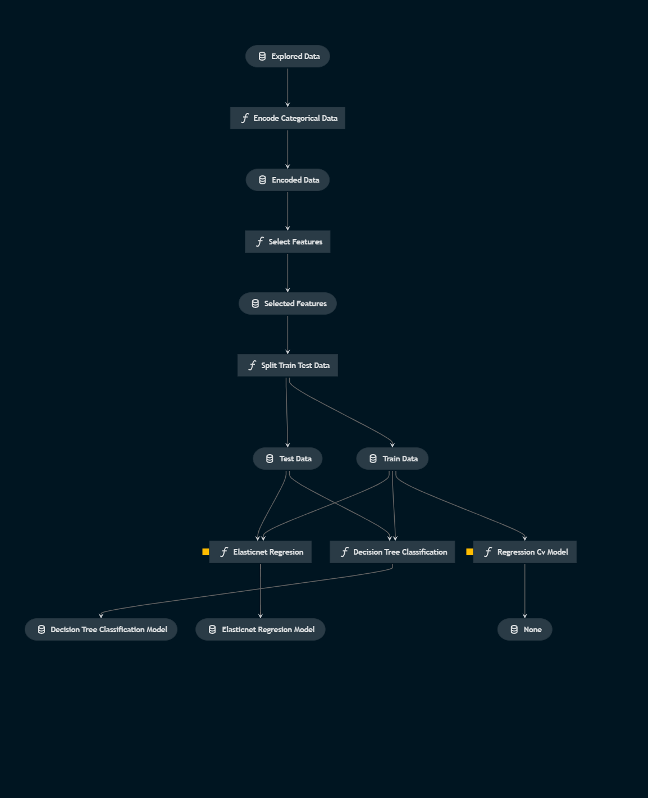
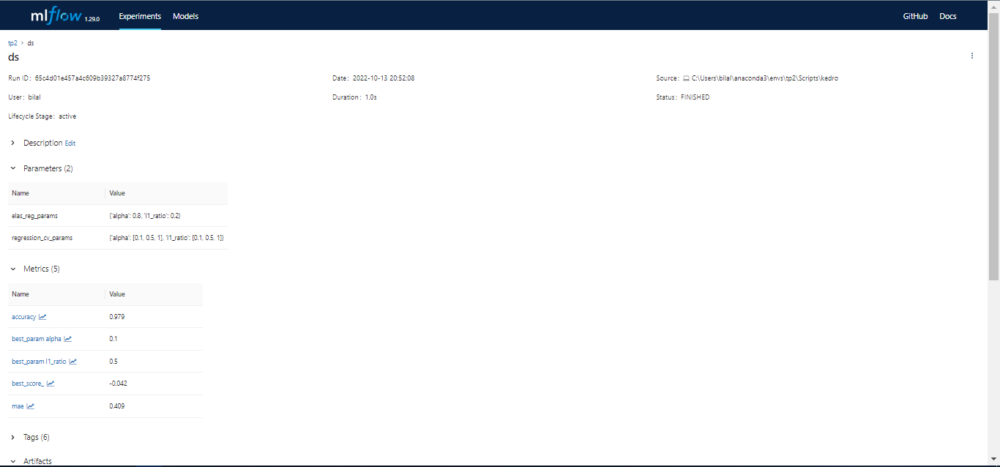

## MLOps projet unsing Kedro and MLFlow

<br>

Kedro: is an open-source Python framework for creating reproducible, maintainable
and modular data science code. It is defined by a structure of nodes and pipelines.
Nodes are the functions that perform any operations on the data. A set of nodes
executed in a sequence is called a pipeline. The most common pipelines are data
engineering and data science pipelines.

<br>


MLFlow: is an open-source platform for managing the end-to-end machine learning lifecycle.  It provides a central place to track experiments, compare results, and share models.


<br>

**Setup kedro env:**
```
conda create --name kedro_env python=3.7
conda activate kedro_env
pip install kedro
```
**Install kedro-viz:**
```
pip install kedro-viz
```
**Install kedro-mlflow:**
```
pip install kedro-mlflow
```
**Install requirements:**
```
pip install -r src/requirements.txt
```

<br>

For now everything is installed and ready to go. Let's start by creating a new kedro project and run it:

**Create a new project:**
```
kedro new
```

**Run the project:**
```
kedro run
```

**Run the project with a specific pipeline:**
```
kedro run --pipeline data_engineering
```

**Run the project with a specific node:**
```
kedro run --node create_report
```


<br>

To visualize the project pipelines, run the following command:


**Run kedro-viz:**
```bash
kedro viz
```

<br>

To track the project metrics with MLFlow, run the following command:

**Run kedro-mlflow:**
```bash
kedro mlflow init
kedro mlflow run
```

**Run kedro-mlflow with a specific pipeline:**
```bash
kedro mlflow run --pipeline data_engineering
```


<br>

Data engineering pipeline:


<br>

Data science pipeline:



<br>

The tracking UI:

